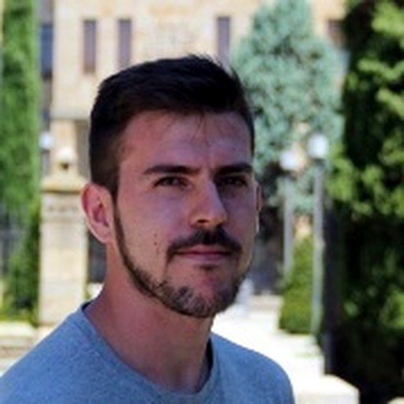
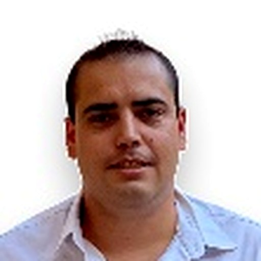

# About

This book contains the course material for **Elaboración de libros electrónicos mediante código y asistentes de Inteligencia Artificial**. It is designed to help teaching staff at the Faculties of Sciences and Chemical Sciences of the University of Salamanca create, adapt and publish interactive teaching books with minimal technical friction.

Citation information, BibTeX, DOI and Zenodo metadata are collected on the [How to Cite](92_how_to_cite.md) page.

## How this book is made

This website is written in Markdown files and Jupyter notebooks, and converted to HTML and PDF using tools from [TeachBooks](https://teachbooks.io/), [Jupyter Book](https://jupyterbook.org/) and [MyST Markdown](https://mystmd.org/).

The source files are stored in a public GitHub repository:

- https://github.com/elloza/teachbook_usal_template

The published version of the book can be viewed at:

- https://elloza.com/teachbook_usal_template/

## About the authors

```{raw} html
<div class="author-profile-grid">
  <article class="author-profile-card">
    
    <div>
      <h3>Álvaro Lozano Murciego</h3>
      <p class="author-profile-role">Associate Professor, Computer Science and Automation</p>
      <div class="author-profile-links">
        <a href="https://produccioncientifica.usal.es/investigadores/148041/detalle">USAL profile</a>
        <a href="https://orcid.org/0000-0002-0493-4471">ORCID</a>
      </div>
    </div>
  </article>
  <article class="author-profile-card">
    
    <div>
      <h3>André Filipe Sales Mendes</h3>
      <p class="author-profile-role">Assistant Professor, Computer Science and Automation</p>
      <div class="author-profile-links">
        <a href="https://produccioncientifica.usal.es/investigadores/147997/detalle?lang=en">USAL profile</a>
        <a href="https://orcid.org/0000-0003-0976-2784">ORCID</a>
      </div>
    </div>
  </article>
</div>
```

````{container} pdf-author-fallback
```{image} ../_static/authors/alvaro_lozano_murciego.jpg
:alt: Portrait of Álvaro Lozano Murciego
:width: 35%
:align: center
```

**Álvaro Lozano Murciego**  
Associate Professor, Computer Science and Automation

- USAL profile: https://produccioncientifica.usal.es/investigadores/148041/detalle
- ORCID: https://orcid.org/0000-0002-0493-4471

```{image} ../_static/authors/andre_filipe_sales_mendes.jpg
:alt: Portrait of André Filipe Sales Mendes
:width: 35%
:align: center
```

**André Filipe Sales Mendes**  
Assistant Professor, Computer Science and Automation

- USAL profile: https://produccioncientifica.usal.es/investigadores/147997/detalle?lang=en
- ORCID: https://orcid.org/0000-0003-0976-2784
````

### Institution

Faculties of Sciences and Chemical Sciences, University of Salamanca (USAL).

Photographs and academic profile information come from the University of Salamanca scientific production portal.
