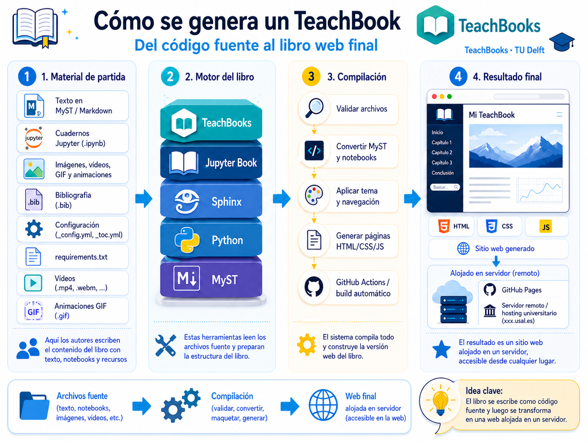

# 1. ¿Qué es un TeachBook?

Un [**TeachBook**](https://teachbooks.io/) es un libro docente digital, construido a partir de archivos de texto, código y recursos multimedia, que luego se compila para obtener una **web navegable** y, en el caso de este curso, también una **versión PDF**.

Dicho de forma simple:

- tú editas **contenido fuente**
- el sistema lo **compila**
- obtienes un libro **atractivo, funcional y publicable**

````{only} html
```{raw} html
<figure class="align-center">
  <picture>
    <source srcset="../../_static/images/1_Que_es_un_teachbook.webp" type="image/webp">
    
  </picture>
  <figcaption>Un TeachBook parte de contenido editable y genera una web docente publicable.</figcaption>
</figure>
```
````

````{only} latex
```{figure} ../../_static/images/1_Que_es_un_teachbook.png
---
name: fig-que-es-un-teachbook
alt: Esquema visual de qué es un TeachBook
width: 85%
align: center
---
Un TeachBook parte de contenido editable y genera una web docente publicable.
```
````

## Atribución y origen

Esta plantilla se apoya en el ecosistema original de:

- [TeachBooks](https://teachbooks.io/)
- [Jupyter Book](https://jupyterbook.org/)

Para situar la plantilla, conviene citar tanto la documentación del proyecto TeachBooks {cite:p}`teachbooksmanual2025` como el trabajo de referencia de Jupyter Book {cite:p}`jupyterbook2025`: la primera aporta el enfoque docente y la segunda el sistema base para construir libros computacionales publicables.

Y esta adaptación concreta ha sido preparada para el curso titulado "Elaboración de libros electrónicos mediante código y asistentes de Inteligencia Artificial" impartido en las **Facultades de Ciencias y de Ciencias Químicas de la Universidad de Salamanca (USAL)**.

Es importante entender esto bien: **no partimos de cero**. Partimos de herramientas existentes y de proyectos previos, y sobre ellas construimos una plantilla adaptada a uso docente real concreto (adaptado a las necesidades de cada curso, pero con potencial de reutilización).

## De qué se parte y qué se obtiene

La idea base del sistema es esta:


La tabla siguiente resume los elementos principales de esta sección.

**Tabla. De qué se parte y qué se obtiene.**

| Se parte de... | Y se obtiene... |
|---|---|
| archivos `.md` y `.ipynb` | páginas web del libro |
| imágenes, bibliografía y recursos estáticos | contenido enriquecido |
| configuración del libro (`_config_*.yml`) | navegación, tema, idioma, extensiones |
| índice (`_toc_*.yml`) | estructura visible del libro |

## Ventajas para la docencia

1. **Accesibilidad**: el libro se puede leer como web desde cualquier dispositivo.
2. **Reproducibilidad**: el contenido sale de archivos fuente versionables.
3. **Mantenibilidad**: actualizar una página es mucho más fácil (gracias a los agentes de IA) que rehacer apuntes enteros.
4. **Escalabilidad**: puedes empezar con una sola página o capítulo y crecer poco a poco.
5. **Compatibilidad**: el mismo proyecto puede servir para una web y un libro en PDF clásico.

## Qué añade esta plantilla respecto a la base original

Sobre la base de TeachBooks y Jupyter Book, en este proyecto hemos añadido cosas muy útiles para profesorado y alumnado:

### 1. Estructura multiidioma

El libro está preparado para trabajar en:

- español
- inglés

con índices y contenido sincronizados. Se podrían añadir más idiomas fácilmente.

### 2. Exportación a PDF

Además de la web, esta plantilla prepara una salida PDF pensada para impresión o distribución offline. No todos los contenidos multimedia e interactivos se pueden exportar, pero el resto de contenidos valiosos sí, permitiendo tener una versión tradicional del libro.

### 3. Automatización con scripts sencillos

No hace falta aprender un flujo complejo desde el primer día. El proyecto trae SKILLS para:

- preparar el entorno (instalar dependencias, configurar variables, etc.)
- compilar la web (generar el libro navegable en local para que puedas revisarlo)
- abrir vista previa en vivo
- exportar PDF
- convertir PDF a Markdown (para reutilizar contenido que ya tienes en PDF de otras asignaturas o cursos)
- etc.

### 4. Integración con agentes de IA

La plantilla está preparada para que un agente te ayude a:

- crear contenido
- reorganizar capítulos
- añadir multimedia
- mantener la estructura del libro
- etc.

## Qué NO es un TeachBook

No es:

- una presentación PowerPoint
- una web hecha con React o frameworks pesados
- una web con diseño personalizado (aunque se puede personalizar el tema, no es el objetivo principal)

La idea central es que el contenido sea **editable, estructurado y reutilizable**.

## Idea práctica para empezar

No intentes construir un libro enorme el primer día.

Empieza por algo pequeño:

- una portada
- un capítulo corto
- una imagen
- una ecuación
- una sección con dos o tres páginas

Cuando eso funcione bien y hayas sido capaz de publicarlo, amplías.

````{only} html
## Bibliografía de esta página

```{bibliography}
:filter: docname in docnames and key in {"teachbooksmanual2025", "jupyterbook2025"}
```
````
